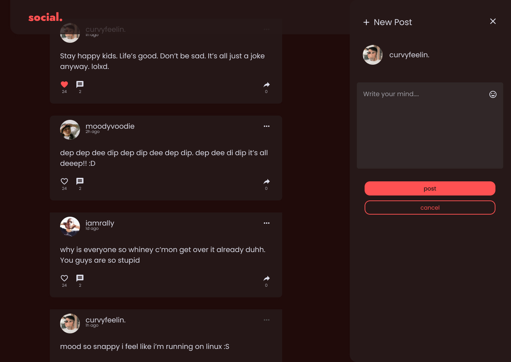
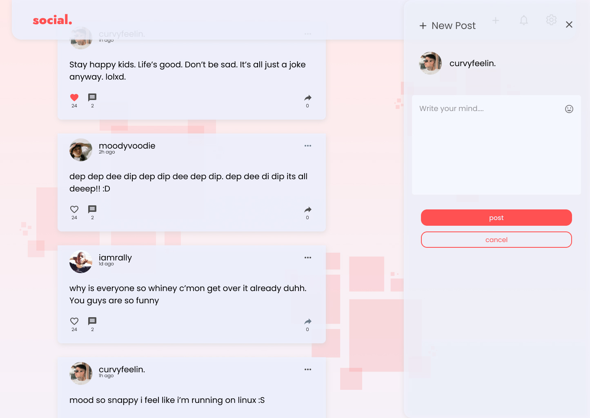
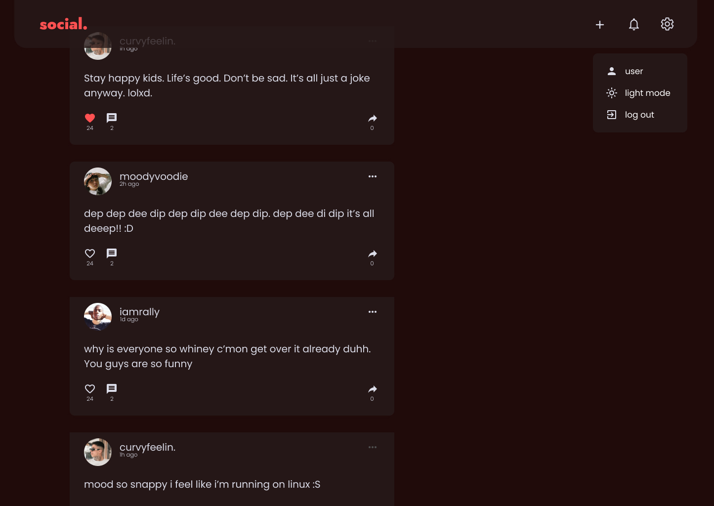

# social.
#### yet another social networking app

I am [@suyious](https://github.com/suyious) and here's social, a not-so-new way to engage with people on the internet that no one asked for but I made anyway. I made social as a personal project while I was learning to use graphQL for the backend. I had been following one of FreeCodeCamp's many useful videos and I was guided mostly by it.

In social, I have implemented the following functionalities for now:
#### 📮 Making Post (obviously)
#### 🙍🏻 Handling user (authentication)
#### 👨🏻‍💻 Login/Logout functionality
#### 🏴 Toggling Dark Mode (A Priority i must say)
#### 👍 Liking posts
#### 💬 Commenting on posts
------
The following will be implemented soon enough:
#### 👗 Editing user profiles

|Light-Mode Design| Dark-Mode Design|
|--|--|
|||

> The app is not public as of right now due to security purpose [ and because me being broke I can't really pay for a real hosting ]
